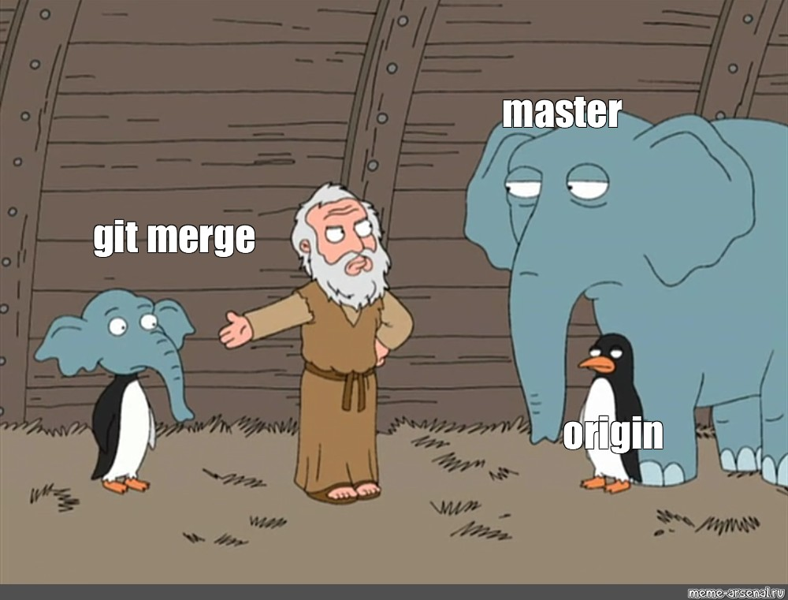
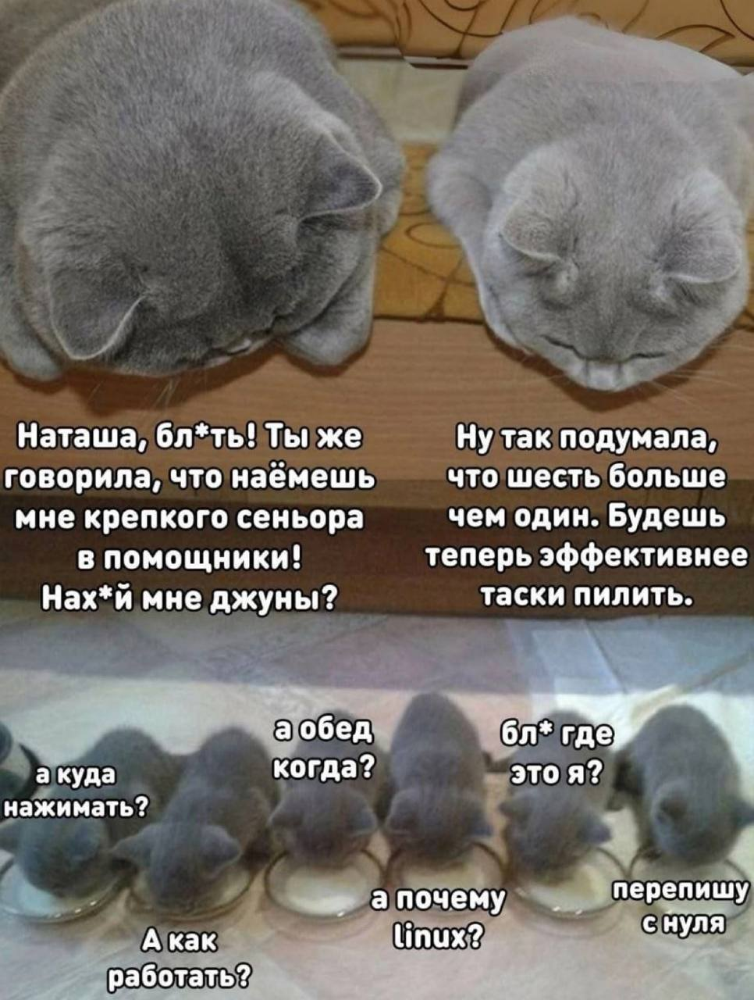

1. # Типы сообщений о комитах

- **feat:** Новая функция

- **fix:** Исправление ошибки

- **docs:** Изменение документации

- **style:** Изменение стиля кода, не влияющее на детали реализации

- **refactor:** Кодовые изменения, которые не исправляют ошибку и не добавляют функцию

- **perf:** Кодовые изменения, улучшающие производительность

- **test:** При тестировании вашего кода

- **chore:** Изменения в процессе сборки или вспомогательных инструментах и библиотеках


## И как вы все любите статья об [Атомарных коммитах](https://habr.com/ru/articles/781794/)

2. # Соглашение об именовании веток

Ветки именуются согласно следующему шаблону:

`feat-task-XXX-new-feature`

Где:
- `feat`, `fix`, `docs`, `style`, `refactor`, `perf`, `test`, `chore` являются префиксами, указывающими на тип внесенных изменений.
- `task-XXX` относится к номеру задачи из Bitrix, где XXX - это конкретный идентификатор задачи.

## Примеры

- `feat-task-953-change-board-name`: Добавление новой функциональности для изменения имени доски.

3. # Простые шаги к эффективному code review

[Статья](https://habr.com/ru/companies/cdek_blog/articles/768506/)


Проверка — это не акция публичной порки и не возможность для самоутверждения за счёт менее опытных коллег. Это — систематический процесс, поэтому важно, чтобы он был приятным для всех участников.

До передачи задачи на проверку работу над ней нужно завершить — провести рефакторинг, чтобы код стал чистым и вызывал удовольствие при чтении, а также убедиться, что реализация работает.

4. # Соглашение о дейликах

Дейлики = «ежедневные короткие планерки». От английского daily – ежедневно.


Дейлики проводятся ежедневно в 11.00

Суть заключается в том, что каждый сотрудник ежедневно с утра сообщает: какой результат у него был за вчера, чем он планирует заниматься сегодня и какие блокеры у него в работе. Дейли хорошо проводить вместе с командой, чтобы понимать, кто чем сегодня будет заниматься.


5. # Полезные расширения 

- [Auto Close Tag](https://marketplace.visualstudio.com/items?itemName=formulahendry.auto-close-tag)
- [Better Comments](https://marketplace.visualstudio.com/items?itemName=aaron-bond.better-comments)
- [Bracket Pair Color DLW](https://marketplace.visualstudio.com/items?itemName=BracketPairColorDLW.bracket-pair-color-dlw)
- [Code Spell Checker](https://marketplace.visualstudio.com/items?itemName=streetsidesoftware.code-spell-checker)
- [Codeium](https://marketplace.visualstudio.com/items?itemName=Codeium.codeium)
- [Color Highlight](https://marketplace.visualstudio.com/items?itemName=naumovs.color-highlight)
- [eCSStractor for VSCode](https://marketplace.visualstudio.com/items?itemName=diz.ecsstractor-port)
- [ES7 React/Redux/GraphQL/React-Native snippets](https://marketplace.visualstudio.com/items?itemName=rodrigovallades.es7-react-js-snippets)
- [ESLint](https://marketplace.visualstudio.com/items?itemName=dbaeumer.vscode-eslint)
- [Git Graph](https://marketplace.visualstudio.com/items?itemName=mhutchie.git-graph)
- [GitLens — Git supercharged](https://marketplace.visualstudio.com/items?itemName=eamodio.gitlens)
- [Image preview](https://marketplace.visualstudio.com/items?itemName=kisstkondoros.vscode-gutter-preview)
- [indent-rainbow](https://marketplace.visualstudio.com/items?itemName=oderwat.indent-rainbow)
- [JavaScript (ES6) code snippets](https://marketplace.visualstudio.com/items?itemName=xabikos.JavaScriptSnippets)
- [Live Server](https://marketplace.visualstudio.com/items?itemName=ritwickdey.LiveServer)
- [Material Icon Theme](https://marketplace.visualstudio.com/items?itemName=PKief.material-icon-theme)
- [Phind.com](https://marketplace.visualstudio.com/items?itemName=phind.phind)
- [Prettier ](https://marketplace.visualstudio.com/items?itemName=esbenp.prettier-vscode)
- [Pretty TypeScript Errors](https://marketplace.visualstudio.com/items?itemName=yoavbls.pretty-ts-errors)
- [Russian - Code Spell Checker](https://marketplace.visualstudio.com/items?itemName=streetsidesoftware.code-spell-checker-russian)
- [SonarLint](https://marketplace.visualstudio.com/items?itemName=SonarSource.sonarlint-vscode)
- [Sort lines](https://marketplace.visualstudio.com/items?itemName=Tyriar.sort-lines)
- [Turbo Console Log](https://marketplace.visualstudio.com/items?itemName=ChakrounAnas.turbo-console-log)

6. # Clean Code

`Если ты встретил код, который "дурно пахнет", исправь его`

- Никаких однобуквенных имен переменных!!!
- Часто по проекту встречаю наименования в useState, которые не являются парами. Не надо так.
- Классы стилей пишем в верблюжем стиле
- Используем алиасы! никаких относительных путей! (ну только если не в одной директории) 
- Строки в коде не должны превышать 120 символов!

[Ты — это то, как ты пишешь. Как расти через качество кода](https://habr.com/ru/companies/oleg-bunin/articles/806413/)

[clean-code-javascript](https://github.com/maksugr/clean-code-javascript)

[Руководство по написанию JavaScript-кода от Airbnb()](https://github.com/leonidlebedev/javascript-airbnb)


7. # Как мы мержимся?

```
git pull origin dev
```

Надо подумать о переходе на rebase

И о том, что надо бы сквошить коммиты

[стакоферфлоу тык](https://ru.stackoverflow.com/questions/1174810/%D0%92-%D1%87%D0%B5%D0%BC-%D1%80%D0%B0%D0%B7%D0%BD%D0%B8%D1%86%D0%B0-%D0%BC%D0%B5%D0%B6%D0%B4%D1%83-git-rebase-%D0%B8-git-merge)





8. # кратко про гит 

  только начинаешь работать? укажи свои данные

  `git config --global user.name "Your Name"`

  `git config --global user.email "your.email@example.com"`

 Популярные команды Git

## Основные команды клонирования и получения данных

- `git clone <url>`: Клонирование репозитория.
- `git fetch`: Получение обновлений из удаленного репозитория без их интеграции.
- `git pull`: Получение обновлений из удаленного репозитория и их интеграция с локальным репозиторием.

## Работа с ветками

- `git branch`: Просмотр списка веток.
- `git checkout <branch_name>`: Переключение между ветками.
- `git switch <branch_name>`: Альтернативная команда для переключения между ветками (начиная с Git версии 2.23).
- `git merge <branch_name>`: Слияние содержимого одной ветки в текущую ветку.
- `git branch -d <branch_name>`: Удаление локальной ветки.
- `git push origin <branch_name>`: Отправка локальной ветки в удаленный репозиторий.

## Команды для работы с коммитами

- `git add .`: Добавление всех измененных файлов в область подготовленных файлов.
- `git commit -m "<message>"`: Создание нового коммита с указанным сообщением.
- `git log`: Просмотр истории коммитов.
- `git log --oneline`: Просмотр истории коммитов читабельно.
- `git checkout <cache>`: Переключение на коммит.
- `git status`: Показывает состояние рабочего дерева и области подготовленных файлов.


9. # Джуны

Давайте джунам задачки. Подходите к ним и ревьювьте их код по очереди 



10. # UI

- никаких `<p>` и `<span>` по проекту - используй Typography 
- никаких `<div>` по проекту - используй Box
- также есть Form
- и Input
- Button.. надо бы переписать на forwardRef
- не удаляйте Badge, он хороший 😎.. и там столько вариантов его стиля разных.. (Кирилл, никаких удалений бейджика!)
- перепишите все Wrapper на Box

11. # Импорты

Сортируйте Импорты!

```
Импорты объединяются в секции, секции разделяются переносом строки. Для фронта выделяются три секции (в таком порядке размещения):

Абсолютные импорты из node_modules;

Абсолютные импорты из src;

Относительные импорты, отсортированные в порядке убывания переходов на более верхний уровень в дереве пути (через ../). 
```

Горячие клавиши для сортировки - `shift` + `alt` + `o`

12. # Для развития

[Размышления о React](https://my-js.org/docs/other/react-philosophies/)

------------------------------------------------


Мой гитхаб - [Skave-a](https://github.com/Skave-a)

Made with ❤️ by Skave-a. 2024